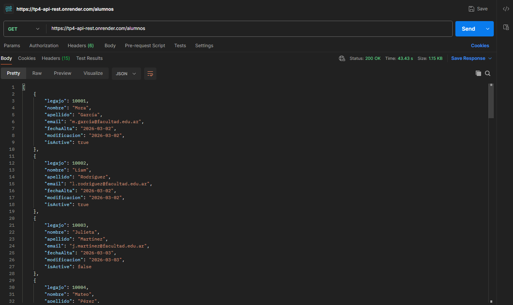
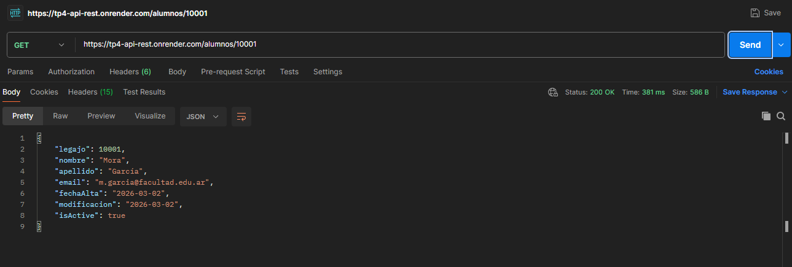
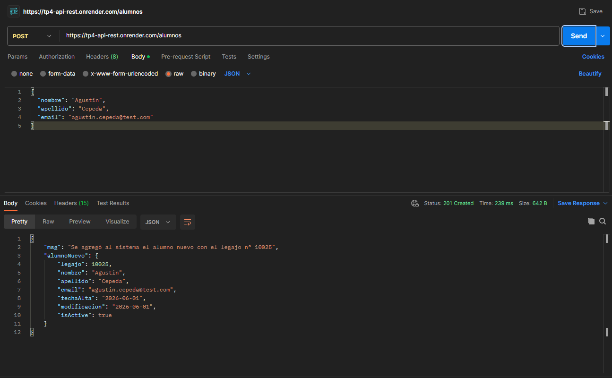
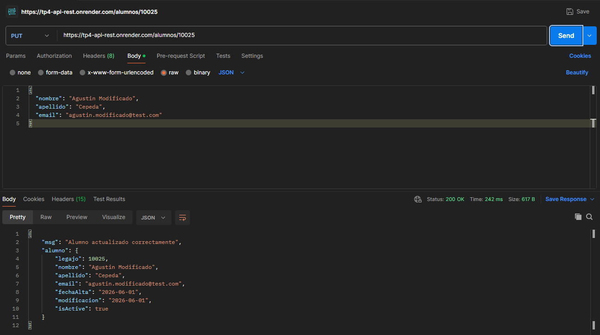
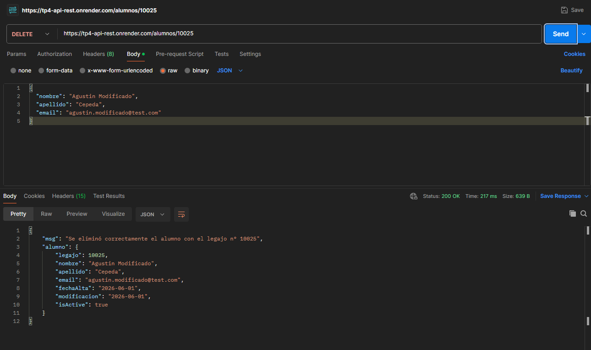

# TP 4 - Nodejs, Render, Docker y Postman

## Grupo N°12

### Integrantes

| N°  | Nombre                       | Rama                      |
| --- | ---------------------------- | ------------------------- |
| 1   | Copreni Rodrigo              | `alumno1-rodrigoCopreni`  |
| 2   | Cepeda Agustín               | `alumno2-agustinCepeda`   |
| 3   | Pascuali Agustín Mateo       | `alumno3-agustinPascuali` |
| 4   | Lares Santiago               | `alumno4-santiagoLares`   |
| 5   | Beltrame Juan Manuel Ramirez | `alumno5-juanBeltrame`    |

---

## Descripción del proyecto

El proyecto es un sistema para realizar las operaciones CRUD(Create, Read, Update, Delete) de alumos. El proyecto consiste en una API REST desarrollada con Node.js y Express que provee los datos del FrontEnd, reemplazando los datos estáticos.

- **BackEnd (Render):** https://tp4-api-rest.onrender.com/alumnos

---

## Metodología de trabajo con Git y GitHub

Se utilizó la metodología de **una rama por alumno**. Cada integrante trabajó en su propia rama y realizó Pull Requests hacia la rama `dev` para integrar los cambios. Una vez que todo estaba listo en `dev`, se hizo el merge final a `main` como entrega.

Flujo de trabajo: rama-alumno → dev → main

## Distribución de carpetas y archivos

tp4-API-REST/
├── controllers/
│ └── alumno.controller.js
│
├──core/
│ └── server.js
│
├── data/
│ └── alumnos.json
│
├── middleware/
│ └── alumno-validator.middleware.js
│
├── models/
│ ├── alumno.model.ts
│ └── persona.model.ts
│
├── routes/
│ └── alumno.routes.js
│
├── .dockerignore
├── .env
├── .gitignore
├── app.js
├── Dockerfile
├── package.json
├── pnpm-lock.yaml
├── README.md
├── settings.json
└── tsconfig.json

## División de archivos entre integrantes

| Archivo / Tarea                                                                                                                | Responsable          |
| ------------------------------------------------------------------------------------------------------------------------------ | -------------------- |
| `Postman collection, Postman screenshots`                                                                                      | Copreni Rodrigo      |
| `controllers/alumno.controller.js, core/server.js, data/alumnos.json, middleware/alumno-validator.middleware.js, package.json` | Cepeda Agustín       |
| `Render, .dockerignore, Dockerfile, server.js, nodemon, pnpm-lock.yaml`                                                        | Lares Santiago       |
| `.dockerignore, Dockerfile, package.json`                                                                                      | Pascuali Agustín     |
| `README.md`                                                                                                                    | Beltrame Juan Manuel |

## Funciones explicadas

### `app.js`

Archivo de entrada del servidor. Importa la clase `Server` desde `core/server.js`, crea una instancia y llama al método `listen()` para iniciar la API.

```js
const Server = require('./core/server')

const servidor = new Server()
servidor.listen()
```

---

### `core/server.js` — Clase `Server`

Clase principal que configura y levanta el servidor Express.

**`constructor()`**
Inicializa la app de Express, define el puerto desde la variable de entorno `PORT` (o 3000 por defecto), y llama a `middleware()` y `rutas()`.

**`middleware()`**
Configura los middlewares globales:

- `cors()` — permite solicitudes desde cualquier origen.
- `express.json()` — permite recibir y parsear cuerpos de solicitud en formato JSON.

**`rutas()`**
Define todas las rutas de la API y las conecta con sus archivos de rutas correspondientes.

**`listen()`**
Pone el servidor a escuchar en el puerto configurado y muestra un mensaje en consola confirmando que la API está activa.

---

### `controllers/alumno.Controller.js`

Este controlador se encarga de manejar todas las operaciones sobre los alumnos utilizando el archivo `alumnos.json` como base de datos. Permite realizar operaciones CRUD (crear, leer, actualizar y eliminar).

#### **`getAlumnoAll (req, res)`**

#### Lee el archivo `alumnos.json` de forma asíncrona y devuelve el array completo de alumnos en formato JSON. Si todo sale bien responde con status 200, mientras que si ocurre un error, responde con status 500.

#### **`getAlumnoById (req, res)`**

#### Recibe un `id` por parámetro de URL, lee `alumnos.json` y busca el alumno cuyo `legajo` coincide. Si lo encuentra responde con el objeto, si no responde con status 404 si no se encontro o con 500 si hay un error.

#### **`postNewAlumno (req, res)`**

#### Recibe los datos del nuevo alumno por parámetro menos el legajo que se crea automáticamente, lee `alumnos.json` y carga el nuevo alumno. Si se pudo cargar responde con status 201, en caso de algun error con status 500.

#### **`putAlumnoBylegajo (req, res)`**

#### Recibe el legajo por parametro y los datos a actualizar en el body, lee `alumnos.json`, busca el alumno a modificar por el legajo y modifica los datos. Si no se encontro el aluimno responde con status 404, si se pudo modificar correctamente con 200 y si hubo algun error con 500.

#### **`deleteAlumnoByLegajo (req, res)`**

#### Recibe el legajo por parametro, lee `alumnos.json` y elimina el alumno. En caso de que se eliminó correctamente responde con status 200 y el alumno eliminado, si no lo encuantra responde con 404 y en caso de error con 500.

---

### `routes/alumno.routes.js`

Define las rutas del endpoint `/alumnos`:

- `GET /alumnos` → `getAlumnoAll` Devuelve todos los alumnos.
- `GET /alumnos/:legajo` → `getAlumnoById` Devuelve un alumno según legajo.

- `POST /alumnos` → `postNewAlumno` Crea un nuevo alumno.

- `PUT /alumnos/:legajo` → `putAlumnoBylegajo` Modifica un alumno según legajo.

- `DELETE /alumnos/:legajo` → `deleteAlumnoByLegajo` Elimina un alumno según legajo.

---

## Estructura de los archivos JSON

### `alumnos.json`

```json
{
  "legajo": 10001,
  "nombre": "Mora",
  "apellido": "García",
  "email": "m.garcia@facultad.edu.ar",
  "fechaAlta": "2026-03-02",
  "modificacion": "2026-03-02",
  "isActive": true
}
```
## Middleware

### `middleware/alumno-validator.middleware.js`

Este middleware valida los datos recibidos en el cuerpo de las peticiones antes de que lleguen al controlador.

#### `validateInputAlumno(req, res, next)`

Valida que los campos recibidos tengan el tipo de dato correcto:

* `nombre` debe ser un string.
* `apellido` debe ser un string.
* `email` debe ser un string.
* `isActive` debe ser un boolean.

Si existe algún error de validación responde con status **400** y un listado de errores. Si los datos son válidos ejecuta `next()` para continuar con la siguiente función de la ruta.

---

## Models

### `models/persona.model.ts`

Clase base utilizada para representar una persona.

#### Constructor

Recibe:

* nombre
* apellido
* email

y los asigna a los atributos de la instancia.

---

### `models/alumno.model.ts`

Clase que hereda de `PersonaModel` y representa a un alumno.

#### Constructor

Además de los datos heredados, recibe:

* legajo

Genera automáticamente:

* fechaAlta
* modificacion
* isActive

#### `getAllAttributes()`

Devuelve un objeto con todos los atributos del alumno para poder almacenarlo dentro del archivo JSON.

---

## Docker

El proyecto fue dockerizado mediante un archivo `Dockerfile` ubicado en la raíz del repositorio.

Para construir la imagen:

```bash
docker build -t tp4-api-rest .
```

Para ejecutar el contenedor:

```bash
docker run -p 3000:3000 tp4-api-rest
```

---

## Deploy en Render

La API fue desplegada utilizando Render mediante un Web Service conectado al repositorio de GitHub.

URL pública:

https://tp4-api-rest.onrender.com/alumnos

El despliegue se realiza automáticamente cuando se actualiza la rama configurada en Render.

---

## Documentación de Endpoints

### GET /alumnos

Obtiene la lista completa de alumnos.

Respuestas:

* 200 OK
* 500 Internal Server Error

### GET /alumnos/:legajo

Obtiene un alumno según su número de legajo.

Respuestas:

* 200 OK
* 404 Not Found
* 500 Internal Server Error

### POST /alumnos

Crea un nuevo alumno.

Respuestas:

* 201 Created
* 400 Bad Request
* 409 Conflict
* 500 Internal Server Error

### PUT /alumnos/:legajo

Actualiza un alumno existente.

Respuestas:

* 200 OK
* 404 Not Found
* 500 Internal Server Error

### DELETE /alumnos/:legajo

Elimina un alumno existente.

Respuestas:

* 200 OK
* 404 Not Found
* 500 Internal Server Error

---

## Evidencias de Postman

1. GET /alumnos


2. GET /alumnos/:legajo


3. POST /alumnos


4. PUT /alumnos/:legajo


5. DELETE /alumnos/:legajo



