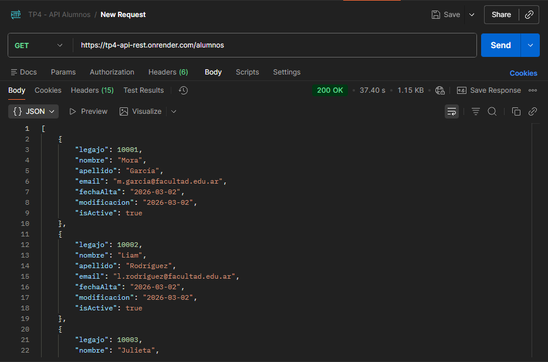
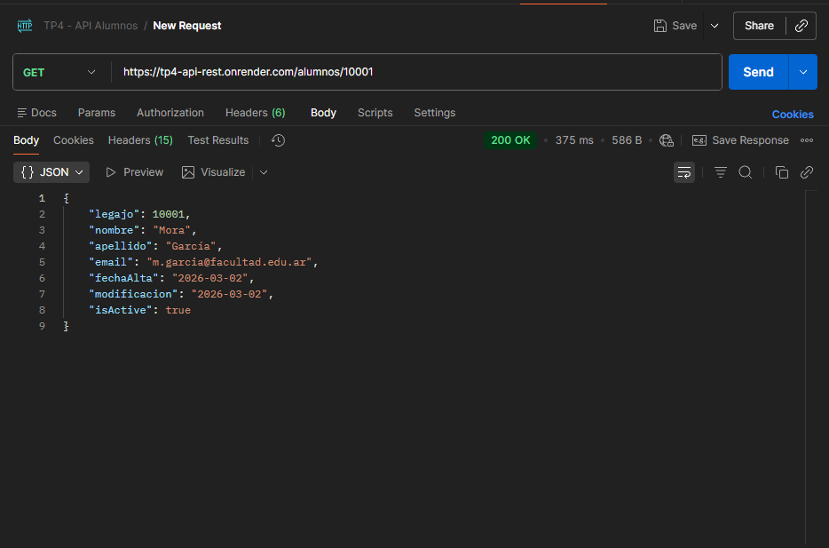
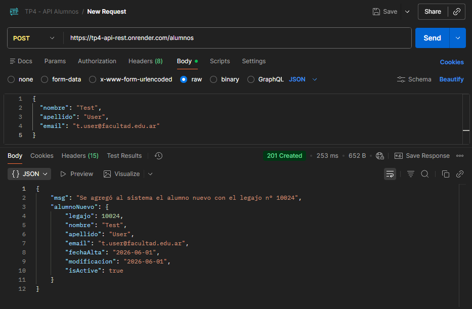
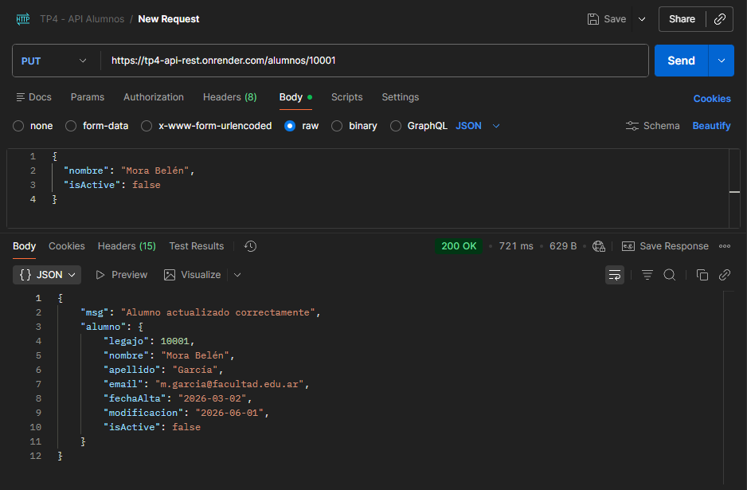
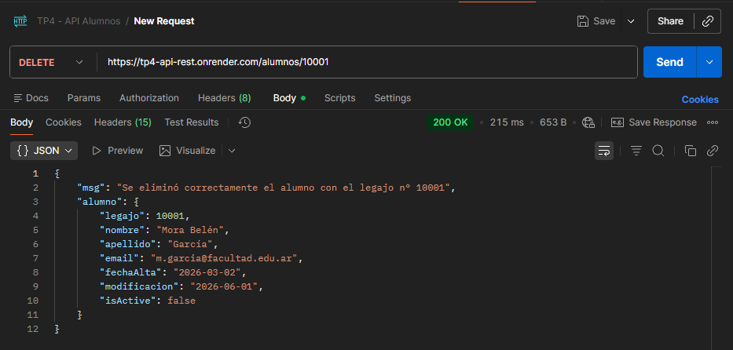

# TP 4 - Nodejs, Render, Docker y Postman

## Grupo N°12

### Integrantes

| N°  | Nombre                       | Rama                      |
| --- | ---------------------------- | ------------------------- |
| 1   | Copreni Rodrigo              | `alumno1-rodrigoCopreni`  |
| 2   | Cepeda Agustín               | `alumno2-agustinCepeda`   |
| 3   | Pascuali Agustín Mateo       | `alumno3-agustinPascuali` |
| 4   | Lares Santiago               | `alumno4-santiagoLares`   |
| 5   | Beltrame Juan Manuel Ramirez | `alumno5-juanBeltrame`    |

---

## Descripción del proyecto

El proyecto es un sistema para realizar las operaciones CRUD(Create, Read, Update, Delete) de alumos. El proyecto consiste en una API REST desarrollada con Node.js y Express que provee los datos del FrontEnd, reemplazando los datos estáticos.

- **BackEnd (Render):** https://tp4-api-rest.onrender.com/alumnos

---

## Metodología de trabajo con Git y GitHub

Se utilizó la metodología de **una rama por alumno**. Cada integrante trabajó en su propia rama y realizó Pull Requests hacia la rama `dev` para integrar los cambios. Una vez que todo estaba listo en `dev`, se hizo el merge final a `main` como entrega.

Flujo de trabajo: rama-alumno → dev → main

## Distribución de carpetas y archivos

tp4-API-REST/
├── controllers/
│ └── alumno.controller.js
│
├──core/
│ └── server.js
│
├── data/
│ └── alumnos.json
│
├── middleware/
│ └── alumno-validator.middleware.js
│
├── models/
│ ├── alumno.model.ts
│ └── persona.model.ts
│
├── routes/
│ └── alumno.routes.js
│
├── .dockerignore
├── .env
├── .gitignore
├── app.js
├── Dockerfile
├── package.json
├── pnpm-lock.yaml
├── README.md
├── settings.json
└── tsconfig.json

## División de archivos entre integrantes

| Archivo / Tarea                                                                                                                | Responsable          |
| ------------------------------------------------------------------------------------------------------------------------------ | -------------------- |
| `Postman collection, Postman screenshots`                                                                                      | Copreni Rodrigo      |
| `controllers/alumno.controller.js, core/server.js, data/alumnos.json, middleware/alumno-validator.middleware.js, package.json` | Cepeda Agustín       |
| `Render, .dockerignore, Dockerfile, server.js, nodemon, pnpm-lock.yaml`                                                        | Lares Santiago       |
| `.dockerignore, Dockerfile, package.json`                                                                                      | Pascuali Agustín     |
| `README.md`                                                                                                                    | Beltrame Juan Manuel |

## Funciones explicadas

### `app.js`

Archivo de entrada del servidor. Importa la clase `Server` desde `core/server.js`, crea una instancia y llama al método `listen()` para iniciar la API.

```js
const Server = require('./core/server')

const servidor = new Server()
servidor.listen()
```

---

### `core/server.js` — Clase `Server`

Clase principal que configura y levanta el servidor Express.

**`constructor()`**
Inicializa la app de Express, define el puerto desde la variable de entorno `PORT` (o 3000 por defecto), y llama a `middleware()` y `rutas()`.

**`middleware()`**
Configura los middlewares globales:

- `cors()` — permite solicitudes desde cualquier origen.
- `express.json()` — permite recibir y parsear cuerpos de solicitud en formato JSON.

**`rutas()`**
Define todas las rutas de la API y las conecta con sus archivos de rutas correspondientes.

**`listen()`**
Pone el servidor a escuchar en el puerto configurado y muestra un mensaje en consola confirmando que la API está activa.

---

### `controllers/alumno.Controller.js`

Este controlador se encarga de manejar todas las operaciones sobre los alumnos utilizando el archivo `alumnos.json` como base de datos. Permite realizar operaciones CRUD (crear, leer, actualizar y eliminar).

#### **`getAlumnoAll (req, res)`**

#### Lee el archivo `alumnos.json` de forma asíncrona y devuelve el array completo de alumnos en formato JSON. Si todo sale bien responde con status 200, mientras que si ocurre un error, responde con status 500.

#### **`getAlumnoById (req, res)`**

#### Recibe un `id` por parámetro de URL, lee `alumnos.json` y busca el alumno cuyo `legajo` coincide. Si lo encuentra responde con el objeto, si no responde con status 404 si no se encontro o con 500 si hay un error.

#### **`postNewAlumno (req, res)`**

#### Recibe los datos del nuevo alumno por parámetro menos el legajo que se crea automáticamente, lee `alumnos.json` y carga el nuevo alumno. Si se pudo cargar responde con status 201, en caso de algun error con status 500.

#### **`putAlumnoBylegajo (req, res)`**

#### Recibe el legajo por parametro y los datos a actualizar en el body, lee `alumnos.json`, busca el alumno a modificar por el legajo y modifica los datos. Si no se encontro el aluimno responde con status 404, si se pudo modificar correctamente con 200 y si hubo algun error con 500.

#### **`deleteAlumnoByLegajo (req, res)`**

#### Recibe el legajo por parametro, lee `alumnos.json` y elimina el alumno. En caso de que se eliminó correctamente responde con status 200 y el alumno eliminado, si no lo encuantra responde con 404 y en caso de error con 500.

---

### `routes/alumno.routes.js`

Define las rutas del endpoint `/alumnos`:

- `GET /alumnos` → `getAlumnoAll` Devuelve todos los alumnos.
- `GET /alumnos/:legajo` → `getAlumnoById` Devuelve un alumno según legajo.

- `POST /alumnos` → `postNewAlumno` Crea un nuevo alumno.

- `PUT /alumnos/:legajo` → `putAlumnoBylegajo` Modifica un alumno según legajo.

- `DELETE /alumnos/:legajo` → `deleteAlumnoByLegajo` Elimina un alumno según legajo.

---

## Estructura de los archivos JSON

### `alumnos.json`

```json
{
  "legajo": 10001,
  "nombre": "Mora",
  "apellido": "García",
  "email": "m.garcia@facultad.edu.ar",
  "fechaAlta": "2026-03-02",
  "modificacion": "2026-03-02",
  "isActive": true
}
```

### `data/extras/sys-materias.json`

```json
{
  "idMateria": "PROG1",
  "nombre": "Programación I",
  "cuatrimestre": 1
}
```

### `data/extras/sys-notas.json`

```json
{
  "id": 1,
  "legajo": 10001,
  "idMateria": "MAT101",
  "nota": 9,
  "fecha": "03-04-24"
}
```

### `data/extras/sys-profesores.json`

> Archivo reservado para la ampliación opcional del proyecto (carpeta `/extras`). Actualmente está vacío; la estructura prevista para cada profesor es:

```json
{
  "idProfesor": "PROF001",
  "nombre": "Gustavo",
  "apellido": "Ramoscelli",
  "materias": ["PROG1"]
}
```

---

## Documentación de los endpoints con Postman

Todas las pruebas se realizaron contra el deploy en Render.

- **URL base:** `https://tp4-api-rest.onrender.com`

| Método   | Endpoint            | Descripción                         | Body (req) | Códigos HTTP       |
| -------- | ------------------- | ----------------------------------- | ---------- | ------------------ |
| `GET`    | `/alumnos`          | Lista todos los alumnos             | —          | 200, 500           |
| `GET`    | `/alumnos/:legajo`  | Obtiene un alumno por legajo        | —          | 200, 404, 500      |
| `POST`   | `/alumnos`          | Crea un alumno (legajo automático)  | JSON       | 201, 400, 409, 500 |
| `PUT`    | `/alumnos/:legajo`  | Modifica un alumno por legajo       | JSON       | 200, 404, 500      |
| `DELETE` | `/alumnos/:legajo`  | Elimina un alumno por legajo        | —          | 200, 404, 500      |

---

### 1. `GET /alumnos`

Devuelve el array completo de alumnos.

**Request**

```
GET https://tp4-api-rest.onrender.com/alumnos
```

**Response — 200 OK**

```json
[
  {
    "legajo": 10001,
    "nombre": "Mora",
    "apellido": "García",
    "email": "m.garcia@facultad.edu.ar",
    "fechaAlta": "2026-03-02",
    "modificacion": "2026-03-02",
    "isActive": true
  }
]
```

<!-- 📸 Reemplazar por la captura de Postman -->


---

### 2. `GET /alumnos/:legajo`

Busca un alumno por su número de legajo.

**Request**

```
GET https://tp4-api-rest.onrender.com/alumnos/10001
```

**Response — 200 OK**

```json
{
  "legajo": 10001,
  "nombre": "Mora",
  "apellido": "García",
  "email": "m.garcia@facultad.edu.ar",
  "fechaAlta": "2026-03-02",
  "modificacion": "2026-03-02",
  "isActive": true
}
```

**Response — 404 Not Found**

```json
{
  "msg": "No existe el alumno con el legajo 99999"
}
```

<!-- 📸 Reemplazar por la captura de Postman -->


---

### 3. `POST /alumnos`

Crea un alumno nuevo. El `legajo` se genera automáticamente. El body se valida con la clase `AlumnoModel`.

**Request**

```
POST https://tp4-api-rest.onrender.com/alumnos
Content-Type: application/json
```

```json
{
  "nombre": "Test",
  "apellido": "User",
  "email": "t.user@facultad.edu.ar"
}
```

**Response — 201 Created**

```json
{
  "msg": "Se agregó al sistema el alumno nuevo con el legajo n° 10024",
  "alumnoNuevo": {
    "legajo": 10024,
    "nombre": "Test",
    "apellido": "User",
    "email": "t.user@facultad.edu.ar",
    "fechaAlta": "2026-06-01",
    "modificacion": "2026-06-01",
    "isActive": true
  }
}
```

**Response — 400 Bad Request** (datos faltantes o inválidos)

```json
{
  "errores": ["Nombre inválido", "Email inválido"]
}
```

**Response — 409 Conflict** (email ya registrado)

```json
{
  "msg": "Ya existe un alumno registrado con el email t.user@facultad.edu.ar"
}
```

<!-- 📸 Reemplazar por la captura de Postman -->


---

### 4. `PUT /alumnos/:legajo`

Modifica los datos de un alumno existente. No se permite modificar el legajo.

**Request**

```
PUT https://tp4-api-rest.onrender.com/alumnos/10001
Content-Type: application/json
```

```json
{
  "nombre": "Mora Belén",
  "isActive": false
}
```

**Response — 200 OK**

```json
{
  "msg": "Alumno actualizado correctamente",
  "alumno": {
    "legajo": 10001,
    "nombre": "Mora Belén",
    "apellido": "García",
    "email": "m.garcia@facultad.edu.ar",
    "fechaAlta": "2026-03-02",
    "modificacion": "2026-06-01",
    "isActive": false
  }
}
```

**Response — 404 Not Found**

```json
{
  "msg": "No se encontró el alumno con el legajo n° 99999"
}
```

<!-- 📸 Reemplazar por la captura de Postman -->


---

### 5. `DELETE /alumnos/:legajo`

Elimina un alumno por su legajo.

**Request**

```
DELETE https://tp4-api-rest.onrender.com/alumnos/10001
```

**Response — 200 OK**

```json
{
  "msg": "Se eliminó correctamente el alumno con el legajo n° 10001",
  "alumno": {
    "legajo": 10001,
    "nombre": "Mora",
    "apellido": "García",
    "email": "m.garcia@facultad.edu.ar",
    "fechaAlta": "2026-03-02",
    "modificacion": "2026-03-02",
    "isActive": true
  }
}
```

**Response — 404 Not Found**

```json
{
  "msg": "No se encontró el alumno con el legajo n° 99999"
}
```

<!-- 📸 Reemplazar por la captura de Postman -->


---

## Tests y cobertura

El proyecto incluye tests automatizados con **Jest** + **ts-jest** y **Supertest**.

```bash
pnpm test
```

Se cubre el **100% de las funciones** del proyecto (controlador, server, middleware y modelos), superando el 90% exigido por la consigna.
